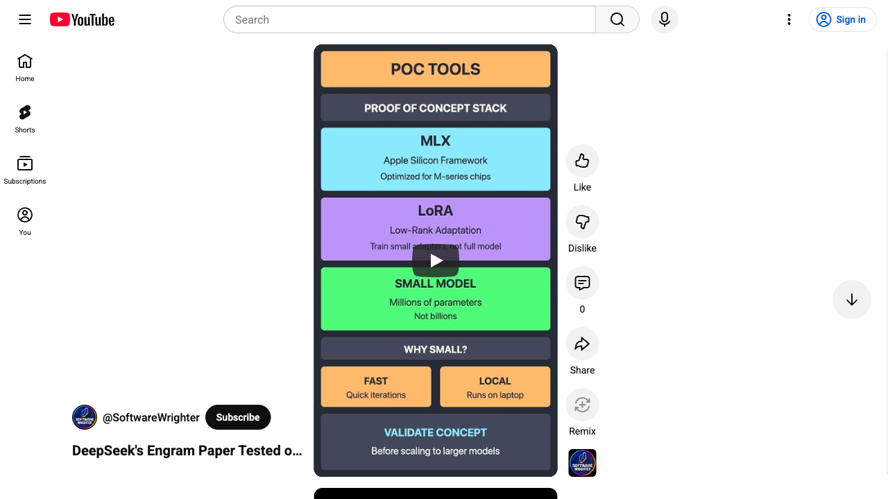
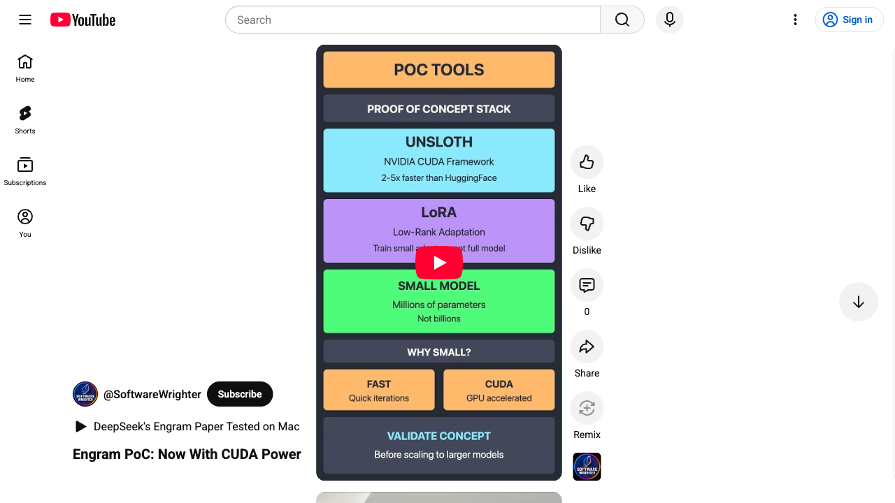
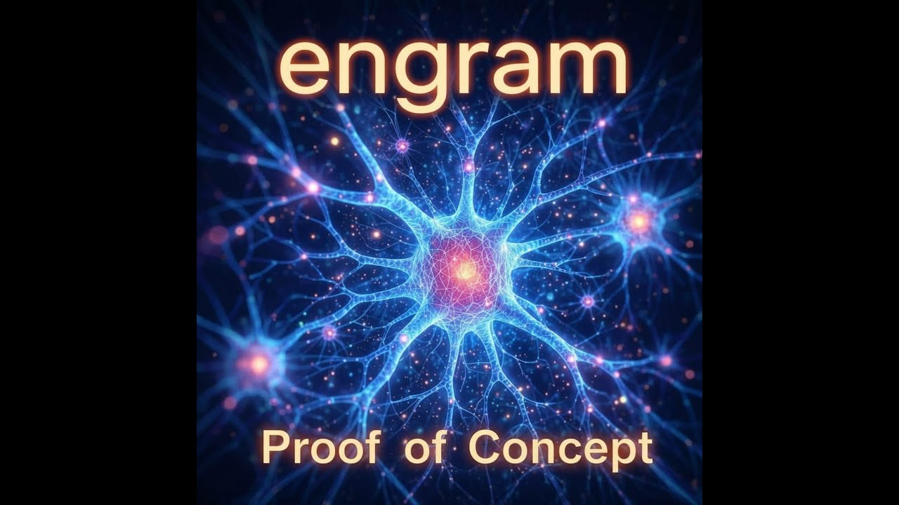

# Engram PoC

A proof-of-concept demonstrating the **Engram** concept from DeepSeek's paper ["Conditional Memory via Scalable Lookup"](https://arxiv.org/abs/2601.07372) using LoRA fine-tuning on small language models.

[](https://www.youtube.com/shorts/aGoQHs6S1nk)

*Part 1: MLX on Apple Silicon*

[](https://www.youtube.com/shorts/uvbfu0WKa3A)

*Part 2: Unsloth on NVIDIA GPU (Arch Linux)*

[](https://www.youtube.com/watch?v=UgB1nZqJ3cE)

*Part 3: Short Explainer Video*

## Overview

Engram introduces **conditional memory as a complementary sparsity axis** for transformers, enabling O(1) lookup operations instead of recomputing common patterns through attention. This PoC approximates Engram benefits through behavioral fine-tuning:

1. **Pattern Injection**: Training data encodes "lookup-like" patterns (code idioms, facts, formatting)
2. **LoRA Adapters**: Learn to recognize and consistently respond to patterns
3. **Evaluation**: Compare consistency and accuracy between base model vs Engram-tuned model

## Results

### Training Metrics
| Metric | Value |
|--------|-------|
| Model | SmolLM-135M-Instruct |
| Training Examples | 337 (augmented from 131 patterns) |
| Training Iterations | 100 |
| Initial Loss | 4.344 |
| Final Loss | 1.815 |
| **Loss Reduction** | **58.2%** |
| Training Time | ~10 seconds (M-series Mac) |

### Evaluation Results
| Metric | Baseline | Engram-tuned | Improvement |
|--------|----------|--------------|-------------|
| Accuracy | 8.65% | 11.54% | **+33.3% relative** |
| Output Style | Verbose explanations | Concise, pattern-aligned | Qualitative |

### Demo Output Example
```
Prompt: Complete: for i in range(

Baseline:     Here is a Python function that implements this approach...
Engram-tuned: len(items)):
```

The tuned model produces direct, pattern-completing responses instead of verbose explanations.

## Quick Start

### Prerequisites

- Apple Silicon Mac (M1/M2/M3/M4)
- Python 3.10+
- [uv](https://github.com/astral-sh/uv) package manager

### Setup

```bash
# Clone the repository
git clone https://github.com/softwarewrighter/engram-poc.git
cd engram-poc

# Create virtual environment with uv
uv venv

# Activate the virtual environment
source .venv/bin/activate

# Install dependencies
uv pip install -r requirements.txt
```

### Run Full Pipeline

```bash
# Run everything: data generation → training → evaluation → demo
./scripts/run_all.sh
```

### Or Run Steps Individually

```bash
# 1. Generate training data (131 patterns → 337 examples)
python -m src.data_gen.generate

# 2. Train LoRA adapter (~10 seconds)
./scripts/train.sh

# 3. Evaluate baseline vs tuned model
./scripts/eval.sh

# 4. Run interactive demo
./scripts/demo.sh
```

## Usage Examples

### Interactive Demo
```bash
# Full interactive demo (pauses between examples)
./scripts/demo.sh

# Quick demo (non-interactive, first 3 examples)
./scripts/demo.sh --quick

# Python demo with options
python -m src.demo.demo --quick --max-tokens 50
```

### Pipeline Options
```bash
# Skip training (use existing adapter)
./scripts/run_all.sh --skip-train

# Skip evaluation
./scripts/run_all.sh --skip-eval

# Skip demo
./scripts/run_all.sh --skip-demo
```

### Direct Model Inference
```bash
# Baseline model
mlx_lm.generate --model HuggingFaceTB/SmolLM-135M-Instruct \
    --prompt "Complete: for i in range(" --max-tokens 20

# Engram-tuned model
mlx_lm.generate --model HuggingFaceTB/SmolLM-135M-Instruct \
    --adapter-path ./adapters \
    --prompt "Complete: for i in range(" --max-tokens 20
```

## Pattern Categories

The PoC includes 131 patterns across 4 categories:

| Category | Count | Examples |
|----------|-------|----------|
| Code Idioms | 33 | `for i in range(` → `len(items)):` |
| Factual Recall | 37 | `Q: HTTP status for 'Not Found'?` → `404` |
| Format Transforms | 29 | `snake_case: getUserName` → `get_user_name` |
| Error Fixes | 32 | `Fix: if x = 5:` → `if x == 5:` |

## Project Structure

```
engram-poc/
├── data/
│   ├── patterns/         # Pattern definition YAML files
│   │   ├── code_idioms.yaml
│   │   ├── facts.yaml
│   │   ├── formats.yaml
│   │   └── error_fixes.yaml
│   ├── train.jsonl       # Generated training data
│   ├── valid.jsonl       # Validation data
│   └── test.jsonl        # Test data with categories
├── src/
│   ├── data_gen/         # Training data generation
│   ├── eval/             # MLX evaluation framework
│   ├── eval_gpu/         # GPU evaluation framework
│   ├── train_gpu/        # Unsloth GPU training
│   └── demo/             # Demo scripts (MLX + unified)
├── adapters/             # Trained LoRA weights
├── results/              # Evaluation results & reports
├── scripts/              # Shell scripts
│   ├── train.sh          # MLX training script
│   ├── train_gpu.sh      # GPU training script
│   ├── eval.sh           # MLX evaluation script
│   ├── eval_gpu.sh       # GPU evaluation script
│   ├── demo.sh           # Demo script
│   └── run_all.sh        # Full pipeline
├── configs/              # Configuration files
└── docs/                 # Documentation
```

## Documentation

### Project Documentation
- [Architecture](docs/architecture.md) - System architecture and Engram concepts
- [PRD](docs/prd.md) - Product requirements document
- [Design](docs/design.md) - Technical design with code snippets
- [Plan](docs/plan.md) - Implementation plan and task breakdown
- [Status](docs/status.md) - Project status tracker
- [GPU Setup](docs/gpu_setup.md) - NVIDIA GPU setup with Unsloth
- [Video Script](docs/video_script.md) - YouTube demo recording guide

### Process Documentation
- [Process](docs/process.md) - Development workflow and processes
- [AI Agent Instructions](docs/ai_agent_instructions.md) - Instructions for AI coding agents
- [Tools](docs/tools.md) - Development tools and setup

### External References
- [Engram Paper (arXiv)](https://arxiv.org/abs/2601.07372)
- [DeepSeek Engram GitHub](https://github.com/deepseek-ai/Engram)
- [MLX-LM Documentation](https://github.com/ml-explore/mlx-examples/tree/main/llms/mlx_lm)
- [LoRA Paper](https://arxiv.org/abs/2106.09685)

## Platform Support

### Apple Silicon (MLX) - This Directory

Run from the **root directory** on macOS with Apple Silicon:

```bash
# Setup
uv venv && source .venv/bin/activate
uv pip install -r requirements.txt

# Run demo
./scripts/run_all.sh
```

- Framework: MLX-LM
- Training: ~10 seconds for 100 iterations
- Status: **Ready for demo**

---

### NVIDIA GPU (Unsloth/CUDA) - Separate Directory

For **Linux with NVIDIA GPU**, use the standalone [`unsloth-nvidia/`](unsloth-nvidia/) directory:

```bash
# Clone and navigate to unsloth directory
git clone https://github.com/softwarewrighter/engram-poc.git
cd engram-poc/unsloth-nvidia

# Setup
uv venv && source .venv/bin/activate
nvidia-smi  # Check CUDA version
uv pip install torch --index-url https://download.pytorch.org/whl/cu124
uv pip install "unsloth[colab-new] @ git+https://github.com/unslothai/unsloth.git"
uv pip install -r requirements.txt

# Run demo
./scripts/run_all.sh
```

**Tested Results (RTX 3060, CUDA 13.0):**
| Metric | Value |
|--------|-------|
| Training Time | 26.1s (1 epoch, 243 examples) |
| Final Loss | 3.19 (from 4.01) |
| Baseline Accuracy | 8.59% |
| Tuned Accuracy | 6.25% |

- Framework: Unsloth + PyTorch + CUDA
- LoRA fine-tuning on NVIDIA GPUs
- 2-5x faster than standard HuggingFace
- Supports 4-bit quantization for larger models
- Status: **Ready for demo**

See [unsloth-nvidia/README.md](unsloth-nvidia/README.md) for detailed setup.

## License

MIT License - see [LICENSE](LICENSE) for details.

## Contributing

See [docs/process.md](docs/process.md) for development workflow and contribution guidelines.
