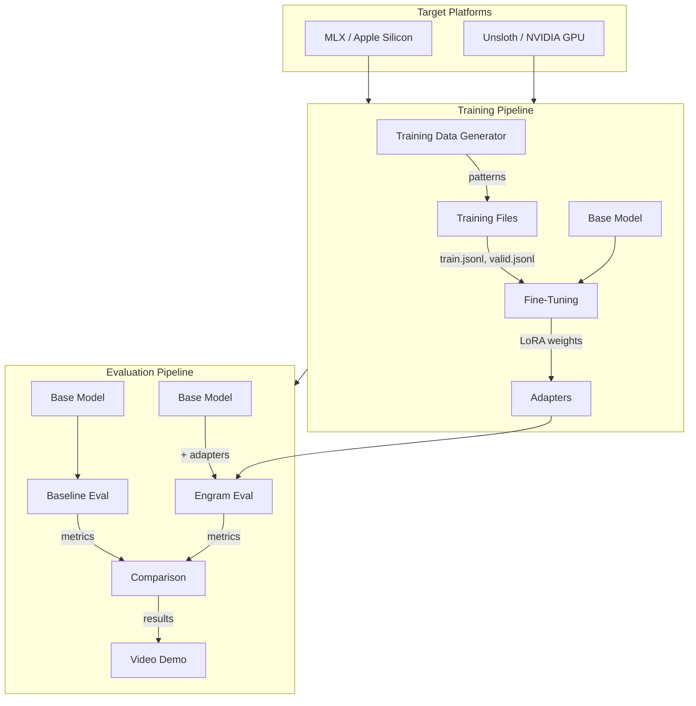

# Engram PoC Architecture

## Overview

This project implements a proof-of-concept for the **Engram** concept from DeepSeek's paper ["Conditional Memory via Scalable Lookup: A New Axis of Sparsity for Large Language Models"](https://arxiv.org/abs/2601.07372). The goal is to demonstrate measurable improvements attributable to Engram-style memory on a tiny model using LoRA fine-tuning.

## What is Engram?

Engram introduces **conditional memory as a complementary sparsity axis** alongside Mixture-of-Experts (MoE). It modernizes classic N-gram embedding technology to enable O(1) lookup operations, allowing transformers to perform efficient knowledge retrieval without relying purely on neural computation.

### Key Concepts

```
┌─────────────────────────────────────────────────────────────────────┐
│                    Traditional Transformer                          │
│  ┌─────────┐    ┌─────────┐    ┌─────────┐    ┌─────────┐         │
│  │ Embed   │ -> │ Attn    │ -> │  FFN    │ -> │ Output  │         │
│  └─────────┘    └─────────┘    └─────────┘    └─────────┘         │
│       ↑              ↑              ↑                               │
│       └──────────────┴──────────────┘                               │
│              Everything computed dynamically                        │
└─────────────────────────────────────────────────────────────────────┘

┌─────────────────────────────────────────────────────────────────────┐
│                    Transformer + Engram                             │
│  ┌─────────┐    ┌─────────┐    ┌─────────┐    ┌─────────┐         │
│  │ Embed   │ -> │ Attn    │ -> │  FFN    │ -> │ Output  │         │
│  └─────────┘    └─────────┘    └─────────┘    └─────────┘         │
│       ↑              ↑              ↑              ↑                │
│       │              │              │              │                │
│  ┌────┴────┐    ┌────┴────┐   ┌────┴────┐        │                │
│  │ N-gram  │    │ Pattern │   │ Static  │        │                │
│  │ Lookup  │    │ Memory  │   │ Facts   │        │                │
│  └─────────┘    └─────────┘   └─────────┘        │                │
│       O(1) lookup - no recomputation needed                        │
└─────────────────────────────────────────────────────────────────────┘
```

### Engram Benefits

1. **Layer Relief**: Reduces burden on early backbone layers from static reconstruction, effectively deepening the network for reasoning tasks

2. **Attention Liberation**: By delegating local dependencies to lookups, frees attention capacity for global context processing

3. **Efficient Knowledge Retrieval**: O(1) lookup for common patterns vs O(n²) attention computation

### Paper Results (Engram-27B vs MoE baselines)

| Benchmark | Improvement |
|-----------|-------------|
| MMLU | +3.4 |
| CMMLU | +4.0 |
| BBH (Reasoning) | +5.0 |
| ARC-Challenge | +3.7 |
| HumanEval (Code) | +3.0 |
| MATH | +2.4 |
| Multi-Query NIAH | 84.2 → 97.0 |

## PoC Architecture

### Approach: LoRA-based Engram Approximation

Since we cannot modify the transformer architecture directly with LoRA, we approximate Engram benefits through **behavioral fine-tuning**:

```
┌─────────────────────────────────────────────────────────────────────┐
│                        PoC Strategy                                  │
├─────────────────────────────────────────────────────────────────────┤
│                                                                      │
│  1. PATTERN INJECTION via Training Data                             │
│     ┌────────────────────────────────────────────────────────┐     │
│     │  Training examples encode "lookup-like" patterns:       │     │
│     │  - Consistent N-gram → response mappings                │     │
│     │  - Deterministic pattern recognition                    │     │
│     │  - Static fact retrieval behaviors                      │     │
│     └────────────────────────────────────────────────────────┘     │
│                                                                      │
│  2. LoRA ADAPTERS learn to recognize and respond to patterns        │
│     ┌────────────────────────────────────────────────────────┐     │
│     │  Base Model (frozen) + LoRA Adapters (~1% params)       │     │
│     │  Adapters learn: pattern → canonical response           │     │
│     └────────────────────────────────────────────────────────┘     │
│                                                                      │
│  3. EVALUATION compares pattern handling vs base model              │
│     ┌────────────────────────────────────────────────────────┐     │
│     │  Metrics: consistency, speed, token efficiency          │     │
│     └────────────────────────────────────────────────────────┘     │
│                                                                      │
└─────────────────────────────────────────────────────────────────────┘
```

### System Components



### Directory Structure

```
engram-poc/
├── docs/
│   ├── research.txt          # Background research and notes
│   ├── architecture.md       # This file
│   ├── prd.md               # Product requirements
│   ├── design.md            # Technical design
│   ├── plan.md              # Implementation plan
│   └── status.md            # Project status
├── data/
│   ├── patterns/            # Pattern definition files
│   ├── train.jsonl          # Generated training data
│   └── valid.jsonl          # Generated validation data
├── src/
│   ├── data_gen/            # Training data generation
│   ├── eval/                # Evaluation harness
│   └── demo/                # Demo scripts
├── adapters/                # Trained LoRA weights
├── results/                 # Evaluation results
└── scripts/
    ├── train.sh             # Training script
    ├── eval.sh              # Evaluation script
    └── demo.sh              # Video demo script
```

## Platform Strategy

### Phase 1: MLX / Apple Silicon

- **Framework**: MLX-LM
- **Model**: SmolLM-135M-Instruct (or Qwen2-0.5B)
- **Training**: `mlx_lm.lora`
- **Inference**: `mlx_lm.generate`
- **Benefits**: Fast iteration, unified memory, simple setup

### Phase 2: Unsloth / NVIDIA GPU

- **Framework**: Unsloth + Transformers
- **Model**: Same base models
- **Training**: Unsloth optimized LoRA
- **Inference**: vLLM or TGI
- **Benefits**: Larger batch sizes, production-ready

## Key Design Decisions

### 1. Pattern Categories for Training

| Category | Description | Engram Analogy |
|----------|-------------|----------------|
| **Idiom Completion** | Code/text patterns with deterministic continuations | N-gram lookup |
| **Fact Retrieval** | Q→A pairs with consistent answers | Static memory |
| **Format Consistency** | Input patterns → consistent output formats | Pattern memory |
| **Error Correction** | Common mistakes → canonical fixes | Transform lookup |

### 2. Evaluation Metrics

| Metric | Description | Why It Matters |
|--------|-------------|----------------|
| **Consistency Score** | Same input → same output rate | Measures "lookup" behavior |
| **Pattern Accuracy** | Correct pattern completions | Core Engram benefit |
| **Generation Speed** | Tokens/second | Efficiency indicator |
| **Token Efficiency** | Useful tokens / total tokens | Less recomputation |

### 3. Demo Scenarios

1. **Code Idiom Completion**: Show consistent completion of common patterns
2. **Fact Retrieval**: Demonstrate reliable Q&A on trained facts
3. **Format Enforcement**: Input → canonical output format
4. **Before/After Comparison**: Base model vs Engram-tuned model

## Relationship to Other Technologies

### Engram vs RAG vs RLM

```
┌────────────────────────────────────────────────────────────────────┐
│                    Memory/Efficiency Stack                          │
├────────────────────────────────────────────────────────────────────┤
│                                                                     │
│  RAG: "What external facts do I need?"                             │
│       → Global, semantic retrieval from vector DB                   │
│       → Good for: documentation, knowledge bases                    │
│                                                                     │
│  RLM: "What should I read next?"                                   │
│       → Control flow for processing large inputs                    │
│       → Good for: long documents, repos, multi-step reasoning      │
│                                                                     │
│  Engram: "What should I stop re-deriving?"                         │
│       → O(1) lookup for local patterns and static facts            │
│       → Good for: idioms, boilerplate, repeated patterns           │
│                                                                     │
│  FlashAttention: "Make remaining attention cheaper"                │
│       → Hardware optimization for attention computation             │
│       → Good for: long context, training efficiency                │
│                                                                     │
└────────────────────────────────────────────────────────────────────┘
```

### Combined Stack Vision

```mermaid
flowchart LR
    subgraph Input["Input Processing"]
        I[User Input]
    end

    subgraph Memory["Memory Layer"]
        EC[Engram Cache<br/>O(1) local patterns]
        RAG[RAG<br/>Global knowledge]
    end

    subgraph Control["Control Layer"]
        RLM[RLM Controller<br/>What to read next]
    end

    subgraph Compute["Compute Layer"]
        LLM[LLM + FlashAttention<br/>Efficient inference]
    end

    I --> RLM
    RLM --> EC
    RLM --> RAG
    EC --> LLM
    RAG --> LLM
    LLM --> O[Output]
```

## Success Criteria

1. **Measurable Improvement**: At least 10% improvement on pattern-based tasks
2. **Demonstrable Difference**: Clear before/after comparison for video
3. **Reproducible**: Scripts that anyone can run
4. **Educational**: Clear explanation of what Engram does and why it helps

## References

- [Engram Paper (arXiv)](https://arxiv.org/abs/2601.07372)
- [DeepSeek Engram GitHub](https://github.com/deepseek-ai/Engram)
- [MLX-LM Documentation](https://github.com/ml-explore/mlx-examples/tree/main/llms/mlx_lm)
- [LoRA Paper](https://arxiv.org/abs/2106.09685)
