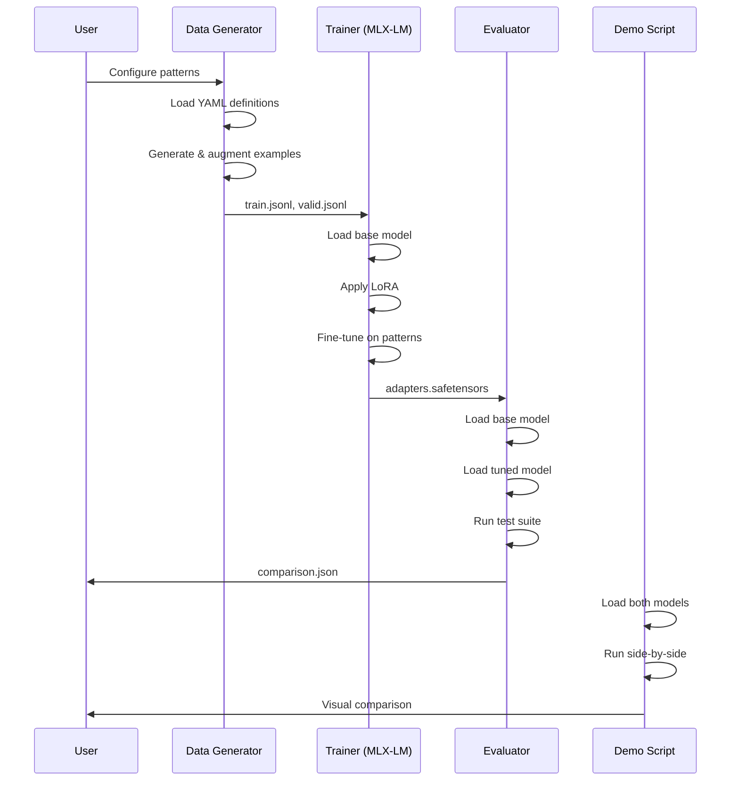

# Engram PoC - Technical Design Document

## Overview

This document details the technical implementation of the Engram PoC, focusing on training data generation, LoRA fine-tuning, evaluation methodology, and demo scripts.

## Design Principles

1. **Simplicity First**: Minimal viable implementation that demonstrates the concept
2. **Fast Iteration**: Training and evaluation complete in minutes
3. **Reproducibility**: Fixed seeds, documented data, versioned outputs
4. **Visual Clarity**: Results that translate well to video

## Component Design

### 1. Training Data Generator

#### Purpose
Generate training examples that teach the model "Engram-like" behavior: consistent pattern → response mappings that mimic O(1) lookup.

#### Architecture

```
┌─────────────────────────────────────────────────────────────────┐
│                    Data Generation Pipeline                      │
├─────────────────────────────────────────────────────────────────┤
│                                                                  │
│  ┌──────────────┐    ┌──────────────┐    ┌──────────────┐      │
│  │   Pattern    │    │   Example    │    │    JSONL     │      │
│  │ Definitions  │ -> │  Generator   │ -> │   Writer     │      │
│  │  (YAML/JSON) │    │              │    │              │      │
│  └──────────────┘    └──────────────┘    └──────────────┘      │
│                             │                    │               │
│                             v                    v               │
│                      ┌──────────────┐    ┌──────────────┐      │
│                      │ Augmentation │    │ train.jsonl  │      │
│                      │  (optional)  │    │ valid.jsonl  │      │
│                      └──────────────┘    └──────────────┘      │
│                                                                  │
└─────────────────────────────────────────────────────────────────┘
```

#### Pattern Definition Format

```yaml
# patterns/code_idioms.yaml
name: code_idioms
description: Common code patterns with deterministic completions
examples:
  - input: "for i in range("
    output: "len(items)):"
    category: loop_idiom

  - input: "if __name__ == "
    output: '"__main__":'
    category: main_guard

  - input: "def __init__(self"
    output: ", *args, **kwargs):"
    category: constructor

  - input: "try:\n    "
    output: "result = operation()\nexcept Exception as e:\n    handle_error(e)"
    category: error_handling
```

```yaml
# patterns/facts.yaml
name: factual_recall
description: Q&A pairs with consistent answers
examples:
  - input: "Q: What is the capital of France?\nA:"
    output: " Paris"
    category: geography

  - input: "Q: What year did Python 3 release?\nA:"
    output: " 2008"
    category: tech_history

  - input: "Q: HTTP status code for 'Not Found'?\nA:"
    output: " 404"
    category: http_codes
```

#### JSONL Output Format (MLX-LM Compatible)

```json
{"messages": [{"role": "user", "content": "Complete: for i in range("}, {"role": "assistant", "content": "len(items)):"}]}
{"messages": [{"role": "user", "content": "Q: What is the capital of France?\nA:"}, {"role": "assistant", "content": " Paris"}]}
```

#### Data Generation Script

```python
# src/data_gen/generate.py

import json
import yaml
import random
from pathlib import Path
from dataclasses import dataclass
from typing import List, Dict, Any

@dataclass
class PatternExample:
    input: str
    output: str
    category: str

@dataclass
class PatternSet:
    name: str
    description: str
    examples: List[PatternExample]

def load_patterns(pattern_dir: Path) -> List[PatternSet]:
    """Load all pattern definition files."""
    patterns = []
    for yaml_file in pattern_dir.glob("*.yaml"):
        with open(yaml_file) as f:
            data = yaml.safe_load(f)
            examples = [
                PatternExample(**ex) for ex in data.get("examples", [])
            ]
            patterns.append(PatternSet(
                name=data["name"],
                description=data["description"],
                examples=examples
            ))
    return patterns

def generate_training_example(pattern: PatternExample) -> Dict[str, Any]:
    """Convert pattern to MLX-LM training format."""
    return {
        "messages": [
            {"role": "user", "content": pattern.input},
            {"role": "assistant", "content": pattern.output}
        ]
    }

def augment_example(pattern: PatternExample) -> List[PatternExample]:
    """Generate variations of a pattern (optional augmentation)."""
    variations = [pattern]

    # Add instruction prefix variations
    prefixes = [
        "Complete: ",
        "Continue: ",
        "Finish this: ",
        ""
    ]

    for prefix in prefixes:
        if prefix:
            variations.append(PatternExample(
                input=prefix + pattern.input,
                output=pattern.output,
                category=pattern.category
            ))

    return variations

def generate_dataset(
    pattern_dir: Path,
    output_dir: Path,
    train_split: float = 0.8,
    augment: bool = True,
    seed: int = 42
) -> None:
    """Generate train.jsonl and valid.jsonl from patterns."""
    random.seed(seed)

    patterns = load_patterns(pattern_dir)
    all_examples = []

    for pattern_set in patterns:
        for example in pattern_set.examples:
            if augment:
                augmented = augment_example(example)
                all_examples.extend(augmented)
            else:
                all_examples.append(example)

    random.shuffle(all_examples)

    split_idx = int(len(all_examples) * train_split)
    train_examples = all_examples[:split_idx]
    valid_examples = all_examples[split_idx:]

    output_dir.mkdir(parents=True, exist_ok=True)

    with open(output_dir / "train.jsonl", "w") as f:
        for ex in train_examples:
            json.dump(generate_training_example(ex), f)
            f.write("\n")

    with open(output_dir / "valid.jsonl", "w") as f:
        for ex in valid_examples:
            json.dump(generate_training_example(ex), f)
            f.write("\n")

    print(f"Generated {len(train_examples)} training examples")
    print(f"Generated {len(valid_examples)} validation examples")

if __name__ == "__main__":
    generate_dataset(
        pattern_dir=Path("data/patterns"),
        output_dir=Path("data"),
        augment=True
    )
```

### 2. Training Configuration

#### MLX-LM LoRA Training

```bash
# scripts/train.sh

#!/usr/bin/env bash
set -euo pipefail

MODEL="HuggingFaceTB/SmolLM-135M-Instruct"
DATA_DIR="./data"
ADAPTER_DIR="./adapters"
ITERS=100

echo "=== Engram PoC Training ==="
echo "Model: $MODEL"
echo "Data: $DATA_DIR"
echo "Output: $ADAPTER_DIR"

# Generate training data
python src/data_gen/generate.py

# Run LoRA fine-tuning
mlx_lm.lora \
    --model "$MODEL" \
    --train \
    --data "$DATA_DIR" \
    --adapter-path "$ADAPTER_DIR" \
    --iters $ITERS \
    --batch-size 4 \
    --lora-rank 8 \
    --learning-rate 1e-5

echo "=== Training Complete ==="
echo "Adapters saved to: $ADAPTER_DIR"
```

#### Training Hyperparameters

| Parameter | Value | Rationale |
|-----------|-------|-----------|
| `--iters` | 100 | Quick training, sufficient for small dataset |
| `--batch-size` | 4 | Fits in memory, reasonable gradient estimates |
| `--lora-rank` | 8 | Standard rank for small models |
| `--learning-rate` | 1e-5 | Conservative, prevents overfitting |
| `--lora-layers` | 16 | Default, adapts all transformer layers |

### 3. Evaluation Framework

#### Evaluation Metrics

```python
# src/eval/metrics.py

from dataclasses import dataclass
from typing import List, Dict, Any
import statistics

@dataclass
class EvalResult:
    prompt: str
    expected: str
    actual: str
    correct: bool
    latency_ms: float

@dataclass
class ConsistencyResult:
    prompt: str
    responses: List[str]
    unique_count: int
    consistency_score: float  # 1.0 = all same, 0.0 = all different

def calculate_accuracy(results: List[EvalResult]) -> float:
    """Calculate percentage of correct responses."""
    if not results:
        return 0.0
    return sum(1 for r in results if r.correct) / len(results)

def calculate_consistency(results: List[ConsistencyResult]) -> float:
    """Calculate average consistency across all prompts."""
    if not results:
        return 0.0
    return statistics.mean(r.consistency_score for r in results)

def calculate_latency_stats(results: List[EvalResult]) -> Dict[str, float]:
    """Calculate latency statistics."""
    latencies = [r.latency_ms for r in results]
    return {
        "mean_ms": statistics.mean(latencies),
        "median_ms": statistics.median(latencies),
        "std_ms": statistics.stdev(latencies) if len(latencies) > 1 else 0.0,
        "min_ms": min(latencies),
        "max_ms": max(latencies)
    }
```

#### Evaluation Runner

```python
# src/eval/runner.py

import json
import time
from pathlib import Path
from typing import List, Optional
from dataclasses import dataclass, asdict
from mlx_lm import load, generate

from .metrics import (
    EvalResult, ConsistencyResult,
    calculate_accuracy, calculate_consistency, calculate_latency_stats
)

@dataclass
class EvalConfig:
    model_name: str
    adapter_path: Optional[str]
    test_file: str
    consistency_runs: int = 5
    max_tokens: int = 50

@dataclass
class EvalReport:
    config: dict
    accuracy: float
    consistency: float
    latency: dict
    per_category: dict
    raw_results: List[dict]

class Evaluator:
    def __init__(self, config: EvalConfig):
        self.config = config
        self.model, self.tokenizer = load(
            config.model_name,
            adapter_path=config.adapter_path
        )

    def evaluate_accuracy(self, test_cases: List[dict]) -> List[EvalResult]:
        """Evaluate correct completion rate."""
        results = []

        for case in test_cases:
            prompt = case["input"]
            expected = case["output"]

            start = time.perf_counter()
            actual = generate(
                self.model,
                self.tokenizer,
                prompt=prompt,
                max_tokens=self.config.max_tokens,
                verbose=False
            )
            latency = (time.perf_counter() - start) * 1000

            # Normalize comparison
            actual_clean = actual.strip()
            expected_clean = expected.strip()

            results.append(EvalResult(
                prompt=prompt,
                expected=expected,
                actual=actual,
                correct=actual_clean.startswith(expected_clean),
                latency_ms=latency
            ))

        return results

    def evaluate_consistency(self, prompts: List[str]) -> List[ConsistencyResult]:
        """Evaluate same-input-same-output rate."""
        results = []

        for prompt in prompts:
            responses = []
            for _ in range(self.config.consistency_runs):
                response = generate(
                    self.model,
                    self.tokenizer,
                    prompt=prompt,
                    max_tokens=self.config.max_tokens,
                    verbose=False
                )
                responses.append(response.strip())

            unique_responses = set(responses)
            consistency = 1.0 - (len(unique_responses) - 1) / max(len(responses) - 1, 1)

            results.append(ConsistencyResult(
                prompt=prompt,
                responses=responses,
                unique_count=len(unique_responses),
                consistency_score=consistency
            ))

        return results

    def run_evaluation(self) -> EvalReport:
        """Run complete evaluation suite."""
        # Load test cases
        with open(self.config.test_file) as f:
            test_cases = [json.loads(line) for line in f]

        # Extract prompts and expected outputs
        cases = [
            {
                "input": tc["messages"][0]["content"],
                "output": tc["messages"][1]["content"],
                "category": tc.get("category", "unknown")
            }
            for tc in test_cases
        ]

        # Run evaluations
        accuracy_results = self.evaluate_accuracy(cases)
        consistency_results = self.evaluate_consistency([c["input"] for c in cases])

        # Calculate metrics
        accuracy = calculate_accuracy(accuracy_results)
        consistency = calculate_consistency(consistency_results)
        latency = calculate_latency_stats(accuracy_results)

        # Per-category breakdown
        categories = set(c["category"] for c in cases)
        per_category = {}
        for cat in categories:
            cat_results = [r for r, c in zip(accuracy_results, cases) if c["category"] == cat]
            per_category[cat] = calculate_accuracy(cat_results)

        return EvalReport(
            config=asdict(self.config),
            accuracy=accuracy,
            consistency=consistency,
            latency=latency,
            per_category=per_category,
            raw_results=[asdict(r) for r in accuracy_results]
        )

def compare_models(
    base_config: EvalConfig,
    tuned_config: EvalConfig,
    output_file: Path
) -> dict:
    """Compare baseline vs fine-tuned model."""

    print("Evaluating baseline model...")
    base_eval = Evaluator(base_config)
    base_report = base_eval.run_evaluation()

    print("Evaluating fine-tuned model...")
    tuned_eval = Evaluator(tuned_config)
    tuned_report = tuned_eval.run_evaluation()

    comparison = {
        "baseline": asdict(base_report),
        "finetuned": asdict(tuned_report),
        "improvement": {
            "accuracy": tuned_report.accuracy - base_report.accuracy,
            "accuracy_pct": ((tuned_report.accuracy - base_report.accuracy) /
                           max(base_report.accuracy, 0.01)) * 100,
            "consistency": tuned_report.consistency - base_report.consistency,
            "latency_change_ms": (tuned_report.latency["mean_ms"] -
                                  base_report.latency["mean_ms"])
        }
    }

    with open(output_file, "w") as f:
        json.dump(comparison, f, indent=2)

    return comparison
```

### 4. Demo Scripts

#### Main Demo Script

```python
# src/demo/demo.py

import argparse
from pathlib import Path
from mlx_lm import load, generate

def print_comparison(prompt: str, base_response: str, tuned_response: str):
    """Pretty print a before/after comparison."""
    print("\n" + "="*60)
    print(f"PROMPT: {prompt}")
    print("-"*60)
    print(f"BASELINE:    {base_response}")
    print(f"ENGRAM-TUNED: {tuned_response}")
    print("="*60)

def run_demo(model_name: str, adapter_path: str):
    """Run interactive demo comparing base vs tuned model."""

    print("Loading baseline model...")
    base_model, base_tok = load(model_name)

    print("Loading Engram-tuned model...")
    tuned_model, tuned_tok = load(model_name, adapter_path=adapter_path)

    demo_prompts = [
        # Code idioms
        "Complete: for i in range(",
        "Complete: if __name__ == ",
        "Complete: def __init__(self",

        # Facts
        "Q: What is the capital of France?\nA:",
        "Q: HTTP status code for 'Not Found'?\nA:",

        # Patterns
        "Format this date: 2024-01-15 ->",
    ]

    print("\n" + "="*60)
    print("       ENGRAM PoC DEMONSTRATION")
    print("="*60)

    for prompt in demo_prompts:
        base_resp = generate(base_model, base_tok, prompt=prompt,
                            max_tokens=30, verbose=False)
        tuned_resp = generate(tuned_model, tuned_tok, prompt=prompt,
                             max_tokens=30, verbose=False)
        print_comparison(prompt, base_resp, tuned_resp)

    print("\n[Demo Complete]")

if __name__ == "__main__":
    parser = argparse.ArgumentParser()
    parser.add_argument("--model", default="HuggingFaceTB/SmolLM-135M-Instruct")
    parser.add_argument("--adapter-path", default="./adapters")
    args = parser.parse_args()

    run_demo(args.model, args.adapter_path)
```

#### Shell Demo Script

```bash
# scripts/demo.sh

#!/usr/bin/env bash
set -euo pipefail

MODEL="HuggingFaceTB/SmolLM-135M-Instruct"
ADAPTER_DIR="./adapters"

echo "╔════════════════════════════════════════════════════════════╗"
echo "║           ENGRAM PoC - Before/After Demo                   ║"
echo "╚════════════════════════════════════════════════════════════╝"
echo ""

# Test prompts
PROMPTS=(
    "Complete: for i in range("
    "Q: What is the capital of France?\nA:"
    "Complete: if __name__ == "
)

echo "▶ BASELINE MODEL (no Engram training)"
echo "────────────────────────────────────────"
for prompt in "${PROMPTS[@]}"; do
    echo "Prompt: $prompt"
    mlx_lm.generate --model "$MODEL" --prompt "$prompt" --max-tokens 30 2>/dev/null
    echo ""
done

echo ""
echo "▶ ENGRAM-TUNED MODEL"
echo "────────────────────────────────────────"
for prompt in "${PROMPTS[@]}"; do
    echo "Prompt: $prompt"
    mlx_lm.generate --model "$MODEL" --adapter-path "$ADAPTER_DIR" \
        --prompt "$prompt" --max-tokens 30 2>/dev/null
    echo ""
done

echo ""
echo "════════════════════════════════════════════════════════════"
echo "Notice: The Engram-tuned model shows more consistent,"
echo "        pattern-aligned responses."
echo "════════════════════════════════════════════════════════════"
```

### 5. Alternative Model Support

#### Model Configuration

```python
# src/config/models.py

from dataclasses import dataclass
from typing import Optional

@dataclass
class ModelConfig:
    name: str
    hf_path: str
    params: str
    context_length: int
    notes: str

SUPPORTED_MODELS = {
    "smollm-135m": ModelConfig(
        name="SmolLM-135M",
        hf_path="HuggingFaceTB/SmolLM-135M-Instruct",
        params="135M",
        context_length=2048,
        notes="Fastest, smallest, good for demos"
    ),
    "smollm-360m": ModelConfig(
        name="SmolLM-360M",
        hf_path="HuggingFaceTB/SmolLM-360M-Instruct",
        params="360M",
        context_length=2048,
        notes="Slightly larger, better quality"
    ),
    "qwen2-0.5b": ModelConfig(
        name="Qwen2-0.5B",
        hf_path="Qwen/Qwen2-0.5B-Instruct",
        params="500M",
        context_length=32768,
        notes="Good balance of size and capability"
    ),
    "phi-2": ModelConfig(
        name="Phi-2",
        hf_path="microsoft/phi-2",
        params="2.7B",
        context_length=2048,
        notes="Larger but still fast on M-series"
    ),
}

def get_model_config(model_key: str) -> ModelConfig:
    """Get configuration for a supported model."""
    if model_key not in SUPPORTED_MODELS:
        raise ValueError(f"Unknown model: {model_key}. "
                        f"Supported: {list(SUPPORTED_MODELS.keys())}")
    return SUPPORTED_MODELS[model_key]
```

### 6. Unsloth/NVIDIA Support (Phase 2)

#### Training Script for Unsloth

```python
# src/train_unsloth.py (Phase 2)

from unsloth import FastLanguageModel
import torch

def train_with_unsloth(
    model_name: str,
    data_path: str,
    output_path: str,
    max_seq_length: int = 2048,
    lora_rank: int = 8,
):
    """Train using Unsloth on NVIDIA GPU."""

    model, tokenizer = FastLanguageModel.from_pretrained(
        model_name=model_name,
        max_seq_length=max_seq_length,
        dtype=None,  # Auto-detect
        load_in_4bit=True,
    )

    model = FastLanguageModel.get_peft_model(
        model,
        r=lora_rank,
        target_modules=["q_proj", "k_proj", "v_proj", "o_proj",
                       "gate_proj", "up_proj", "down_proj"],
        lora_alpha=16,
        lora_dropout=0,
        bias="none",
        use_gradient_checkpointing=True,
    )

    # Training setup would continue here...
    # This is a placeholder for Phase 2 implementation

    return model, tokenizer
```

## Data Flow



## File Structure

```
engram-poc/
├── data/
│   ├── patterns/
│   │   ├── code_idioms.yaml
│   │   ├── facts.yaml
│   │   ├── formats.yaml
│   │   └── error_fixes.yaml
│   ├── train.jsonl           # Generated
│   ├── valid.jsonl           # Generated
│   └── test.jsonl            # For evaluation
│
├── src/
│   ├── __init__.py
│   ├── data_gen/
│   │   ├── __init__.py
│   │   └── generate.py
│   ├── eval/
│   │   ├── __init__.py
│   │   ├── metrics.py
│   │   └── runner.py
│   ├── demo/
│   │   ├── __init__.py
│   │   └── demo.py
│   └── config/
│       ├── __init__.py
│       └── models.py
│
├── adapters/                  # Trained weights
│   └── adapters.safetensors
│
├── results/
│   └── comparison.json
│
├── scripts/
│   ├── train.sh
│   ├── eval.sh
│   └── demo.sh
│
├── docs/
│   ├── architecture.md
│   ├── prd.md
│   ├── design.md
│   ├── plan.md
│   └── status.md
│
├── requirements.txt
├── pyproject.toml
└── README.md
```

## Testing Strategy

### Unit Tests

```python
# tests/test_data_gen.py

def test_pattern_loading():
    """Verify YAML patterns load correctly."""
    patterns = load_patterns(Path("data/patterns"))
    assert len(patterns) > 0

def test_jsonl_format():
    """Verify output matches MLX-LM expected format."""
    example = generate_training_example(PatternExample(
        input="test input",
        output="test output",
        category="test"
    ))
    assert "messages" in example
    assert len(example["messages"]) == 2
```

### Integration Tests

```bash
# Run full pipeline test
./scripts/test_pipeline.sh
```

### Evaluation Tests

```python
# tests/test_eval.py

def test_consistency_calculation():
    """Verify consistency metric calculation."""
    result = ConsistencyResult(
        prompt="test",
        responses=["a", "a", "a"],
        unique_count=1,
        consistency_score=1.0
    )
    assert result.consistency_score == 1.0
```

## Error Handling

| Error | Handling |
|-------|----------|
| Model not found | Informative error with download instructions |
| Out of memory | Suggest smaller model or batch size |
| Invalid pattern YAML | Validate schema on load |
| Training divergence | Early stopping, learning rate adjustment |

## Performance Considerations

| Operation | Target | Notes |
|-----------|--------|-------|
| Data generation | <1s | Cached after first run |
| Training (100 iters) | <10s | On M-series Mac |
| Single inference | <100ms | For demo responsiveness |
| Full evaluation | <2min | All test cases |

## Security Considerations

- No external API calls during training (all local)
- No sensitive data in training examples
- Adapters don't contain full model weights
- Pattern definitions are human-readable
