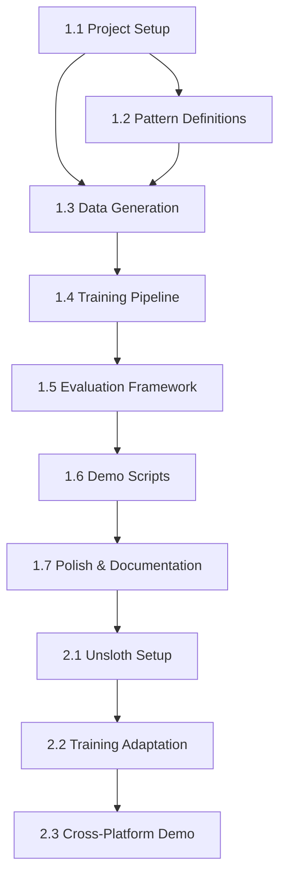

# Engram PoC - Implementation Plan

## Overview

This document outlines the phased implementation plan for the Engram PoC, designed for incremental progress with demonstrable milestones.

## Timeline Overview

```
Week 1: Foundation & Data Generation
Week 2: Training & Evaluation
Week 3: Demo Polish & Video Recording
Week 4+: Phase 2 (Unsloth/NVIDIA) - Optional
```

## Phase 1: MLX / Apple Silicon (Primary)

### Milestone 1.1: Project Setup
**Duration**: 2-4 hours

| Task | Description | Deliverable |
|------|-------------|-------------|
| 1.1.1 | Create directory structure | Folders per design.md |
| 1.1.2 | Initialize Python environment | requirements.txt, pyproject.toml |
| 1.1.3 | Install MLX-LM | `pip install mlx-lm` |
| 1.1.4 | Verify base model works | Test SmolLM-135M generation |
| 1.1.5 | Create README | Basic setup instructions |

**Verification**:
```bash
mlx_lm.generate --model HuggingFaceTB/SmolLM-135M-Instruct \
    --prompt "Hello, world!"
```

### Milestone 1.2: Pattern Definitions
**Duration**: 2-4 hours

| Task | Description | Deliverable |
|------|-------------|-------------|
| 1.2.1 | Create code_idioms.yaml | 20+ Python code patterns |
| 1.2.2 | Create facts.yaml | 20+ Q&A pairs |
| 1.2.3 | Create formats.yaml | 10+ formatting patterns |
| 1.2.4 | Create error_fixes.yaml | 10+ error correction patterns |
| 1.2.5 | Review pattern quality | Human review, no duplicates |

**Pattern Targets**:
- Total: 60+ unique patterns
- After augmentation: 200+ training examples
- Validation split: 20%

**Example Code Idiom**:
```yaml
- input: "for i in range("
  output: "len(items)):"
  category: loop_idiom
```

### Milestone 1.3: Data Generation
**Duration**: 4-6 hours

| Task | Description | Deliverable |
|------|-------------|-------------|
| 1.3.1 | Implement PatternExample dataclass | src/data_gen/types.py |
| 1.3.2 | Implement YAML loader | src/data_gen/loader.py |
| 1.3.3 | Implement augmentation | src/data_gen/augment.py |
| 1.3.4 | Implement JSONL writer | src/data_gen/writer.py |
| 1.3.5 | Create main generate.py | src/data_gen/generate.py |
| 1.3.6 | Generate initial dataset | data/train.jsonl, data/valid.jsonl |

**Verification**:
```bash
python -m src.data_gen.generate
wc -l data/train.jsonl data/valid.jsonl
head -3 data/train.jsonl
```

### Milestone 1.4: Training Pipeline
**Duration**: 2-4 hours

| Task | Description | Deliverable |
|------|-------------|-------------|
| 1.4.1 | Create training script | scripts/train.sh |
| 1.4.2 | Configure hyperparameters | 100 iters, lr=1e-5, rank=8 |
| 1.4.3 | Run initial training | adapters/adapters.safetensors |
| 1.4.4 | Verify adapter loads | Test generation with adapter |
| 1.4.5 | Document training metrics | Training loss curve |

**Verification**:
```bash
./scripts/train.sh
mlx_lm.generate --model HuggingFaceTB/SmolLM-135M-Instruct \
    --adapter-path ./adapters \
    --prompt "Complete: for i in range("
```

### Milestone 1.5: Evaluation Framework
**Duration**: 4-6 hours

| Task | Description | Deliverable |
|------|-------------|-------------|
| 1.5.1 | Implement metrics module | src/eval/metrics.py |
| 1.5.2 | Implement evaluator class | src/eval/runner.py |
| 1.5.3 | Implement comparison logic | src/eval/compare.py |
| 1.5.4 | Create evaluation script | scripts/eval.sh |
| 1.5.5 | Generate test dataset | data/test.jsonl |
| 1.5.6 | Run baseline evaluation | results/baseline.json |
| 1.5.7 | Run tuned evaluation | results/tuned.json |
| 1.5.8 | Generate comparison report | results/comparison.json |

**Verification**:
```bash
./scripts/eval.sh
cat results/comparison.json | jq '.improvement'
```

### Milestone 1.6: Demo Scripts
**Duration**: 2-4 hours

| Task | Description | Deliverable |
|------|-------------|-------------|
| 1.6.1 | Create Python demo | src/demo/demo.py |
| 1.6.2 | Create shell demo | scripts/demo.sh |
| 1.6.3 | Add pretty output formatting | Color, boxes, timing |
| 1.6.4 | Test screen recording | Verify terminal looks good |
| 1.6.5 | Create full pipeline script | scripts/run_all.sh |

**Verification**:
```bash
./scripts/demo.sh 2>&1 | head -50
```

### Milestone 1.7: Polish & Documentation
**Duration**: 2-4 hours

| Task | Description | Deliverable |
|------|-------------|-------------|
| 1.7.1 | Update README | Full instructions |
| 1.7.2 | Add inline comments | Key code documented |
| 1.7.3 | Create video script | docs/video_script.md |
| 1.7.4 | Record test run | Verify everything works |
| 1.7.5 | Update status.md | Mark Phase 1 complete |

## Phase 2: Unsloth / NVIDIA GPU (Secondary)

### Milestone 2.1: Environment Setup
**Duration**: 2-4 hours

| Task | Description | Deliverable |
|------|-------------|-------------|
| 2.1.1 | Install Unsloth | pip install unsloth |
| 2.1.2 | Verify GPU detection | Check CUDA available |
| 2.1.3 | Test base model | Load SmolLM on GPU |
| 2.1.4 | Create requirements-gpu.txt | GPU-specific dependencies |

### Milestone 2.2: Training Adaptation
**Duration**: 4-6 hours

| Task | Description | Deliverable |
|------|-------------|-------------|
| 2.2.1 | Create Unsloth training script | src/train_unsloth.py |
| 2.2.2 | Adapt data loading | Compatible with Unsloth |
| 2.2.3 | Run training | adapters_gpu/ |
| 2.2.4 | Compare training speed | MLX vs Unsloth metrics |

### Milestone 2.3: Cross-Platform Demo
**Duration**: 2-4 hours

| Task | Description | Deliverable |
|------|-------------|-------------|
| 2.3.1 | Create unified demo script | Works on both platforms |
| 2.3.2 | Add platform detection | Auto-select MLX or Unsloth |
| 2.3.3 | Create comparison video | Side-by-side platforms |

## Task Dependencies



## Detailed Task Breakdown

### Sprint 1: Foundation (Days 1-3)

```
Day 1:
  [ ] 1.1.1 Create directory structure
  [ ] 1.1.2 Initialize Python environment
  [ ] 1.1.3 Install MLX-LM
  [ ] 1.1.4 Verify base model works
  [ ] 1.1.5 Create README

Day 2:
  [ ] 1.2.1 Create code_idioms.yaml
  [ ] 1.2.2 Create facts.yaml
  [ ] 1.2.3 Create formats.yaml
  [ ] 1.2.4 Create error_fixes.yaml
  [ ] 1.2.5 Review pattern quality

Day 3:
  [ ] 1.3.1 Implement PatternExample dataclass
  [ ] 1.3.2 Implement YAML loader
  [ ] 1.3.3 Implement augmentation
  [ ] 1.3.4 Implement JSONL writer
  [ ] 1.3.5 Create main generate.py
  [ ] 1.3.6 Generate initial dataset
```

### Sprint 2: Training & Evaluation (Days 4-6)

```
Day 4:
  [ ] 1.4.1 Create training script
  [ ] 1.4.2 Configure hyperparameters
  [ ] 1.4.3 Run initial training
  [ ] 1.4.4 Verify adapter loads
  [ ] 1.4.5 Document training metrics

Day 5:
  [ ] 1.5.1 Implement metrics module
  [ ] 1.5.2 Implement evaluator class
  [ ] 1.5.3 Implement comparison logic
  [ ] 1.5.4 Create evaluation script

Day 6:
  [ ] 1.5.5 Generate test dataset
  [ ] 1.5.6 Run baseline evaluation
  [ ] 1.5.7 Run tuned evaluation
  [ ] 1.5.8 Generate comparison report
```

### Sprint 3: Demo & Polish (Days 7-9)

```
Day 7:
  [ ] 1.6.1 Create Python demo
  [ ] 1.6.2 Create shell demo
  [ ] 1.6.3 Add pretty output formatting
  [ ] 1.6.4 Test screen recording
  [ ] 1.6.5 Create full pipeline script

Day 8:
  [ ] 1.7.1 Update README
  [ ] 1.7.2 Add inline comments
  [ ] 1.7.3 Create video script

Day 9:
  [ ] 1.7.4 Record test run
  [ ] 1.7.5 Update status.md
  [ ] Final review and cleanup
```

## Risk Mitigation

| Risk | Likelihood | Impact | Mitigation |
|------|------------|--------|------------|
| LoRA doesn't capture pattern behavior | Medium | High | Start with simple patterns, iterate on data |
| Training doesn't converge | Low | Medium | Adjust learning rate, check data quality |
| Results not visually compelling | Medium | High | Carefully choose demo prompts |
| MLX version issues | Low | Medium | Pin versions, test early |
| Time overrun | Medium | Medium | Focus on P0 tasks first |

## Definition of Done

### Phase 1 Complete When:
- [ ] All code files exist per design.md structure
- [ ] Training completes without errors in <5 minutes
- [ ] Evaluation shows measurable improvement (>10% accuracy)
- [ ] Demo script produces clear before/after comparison
- [ ] README has complete setup instructions
- [ ] All scripts are executable and tested

### Phase 2 Complete When:
- [ ] Unsloth training produces equivalent results
- [ ] Cross-platform demo works
- [ ] Performance comparison documented

## Checklist for Video Recording

Before recording the YouTube video:

- [ ] Fresh terminal, clean environment
- [ ] All models pre-downloaded (no wait time)
- [ ] Training data pre-generated
- [ ] Screen resolution suitable for recording
- [ ] Terminal font size readable
- [ ] Remove any personal info from terminal
- [ ] Test run complete pipeline once
- [ ] Have backup recordings of key moments
- [ ] Prepare talking points for each demo section

## Commands Quick Reference

```bash
# Setup
pip install mlx-lm pyyaml

# Generate data
python -m src.data_gen.generate

# Train
./scripts/train.sh
# or
mlx_lm.lora --model HuggingFaceTB/SmolLM-135M-Instruct \
    --train --data ./data --iters 100

# Evaluate
./scripts/eval.sh
# or
python -m src.eval.runner

# Demo
./scripts/demo.sh
# or
python -m src.demo.demo

# Full pipeline
./scripts/run_all.sh
```

## Notes for AI Coding Agent

When implementing this plan:

1. **Start Simple**: Get the happy path working before adding error handling
2. **Test Incrementally**: Verify each milestone before moving on
3. **Use Provided Code**: Design.md has working code snippets to start from
4. **Preserve Interface Contracts**: Keep function signatures stable
5. **Document Changes**: Update docs if implementation differs from plan
6. **Ask Questions**: If something is unclear, clarify before implementing
