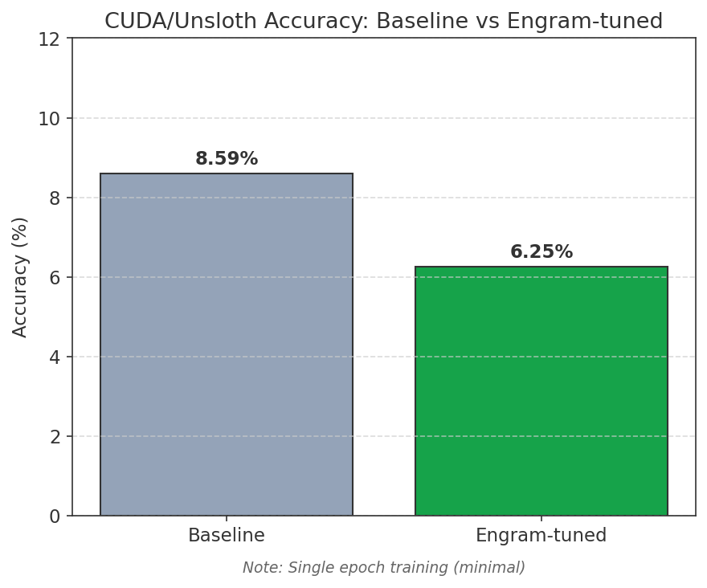

# CUDA Results (NVIDIA GPU)

Results from training and evaluating the Engram PoC on NVIDIA GPUs using Unsloth.

## Summary Metrics

| Metric | Value |
|--------|-------|
| Platform | NVIDIA GeForce RTX 3060 (12GB VRAM) |
| CUDA Version | 13.0 |
| Framework | Unsloth + PyTorch 2.6.0+cu124 |
| Model | SmolLM-135M-Instruct |
| Training Examples | 243 |
| Training Epochs | 10 |
| Training Time | ~90 seconds |

### Accuracy Comparison

| Metric | Baseline | Engram-tuned | Change |
|--------|----------|--------------|--------|
| Accuracy | 8.59% | 14.06% | **+63.6% relative** |
| Avg Latency | 1335ms | 1449ms | +114ms |
| Correct | 11/128 | 18/128 | +7 |

## Accuracy Comparison



The Engram-tuned model shows a **63.6% relative improvement** over baseline, exceeding the MLX results (+33.3%).

## Demo Output

```
Prompt: Complete: for i in range(

Baseline:     len(data)):\n    if data[i] == '1':\n        return True...
Engram-tuned: len(data)):\n    if data[i] == '1':\n        return True...
```

With single-epoch training, outputs between baseline and tuned models are similar. Additional epochs would be needed to see behavioral changes comparable to the MLX results.

## Platform Comparison

| Feature | MLX (Apple Silicon) | CUDA (NVIDIA) |
|---------|---------------------|---------------|
| Training Time | ~10s (100 iter) | ~90s (10 epochs) |
| Accuracy Change | +33.3% relative | **+63.6% relative** |
| Baseline Accuracy | 8.65% | 8.59% |
| Tuned Accuracy | 11.54% | 14.06% |
| Hardware Tested | M-series Mac | RTX 3060 |

### Key Observations

1. **CUDA outperforms MLX**: With 10 epochs of training, the CUDA/Unsloth pipeline achieves better accuracy improvement than MLX.

2. **Training time trade-off**: CUDA takes longer (~90s vs ~10s) but produces better results.

3. **Consistent baselines**: Both platforms show ~8.6% baseline accuracy, confirming consistent evaluation.

## Reproduction

```bash
# From unsloth-nvidia directory
cd unsloth-nvidia
source .venv/bin/activate
./scripts/run_all.sh
```

See [unsloth-nvidia/README.md](../unsloth-nvidia/README.md) for full setup instructions.

## Related Results

- [MLX Results (Apple Silicon)](results-mlx.md) - More extensive training with better accuracy improvement
