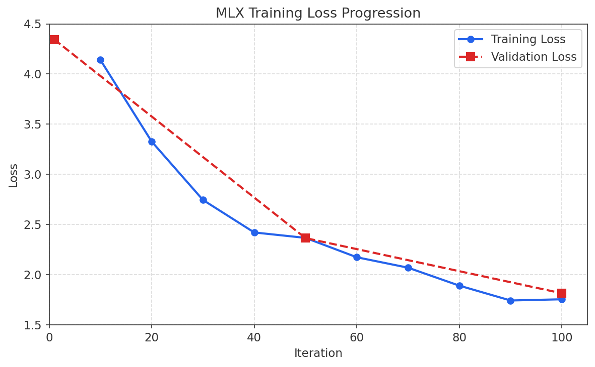
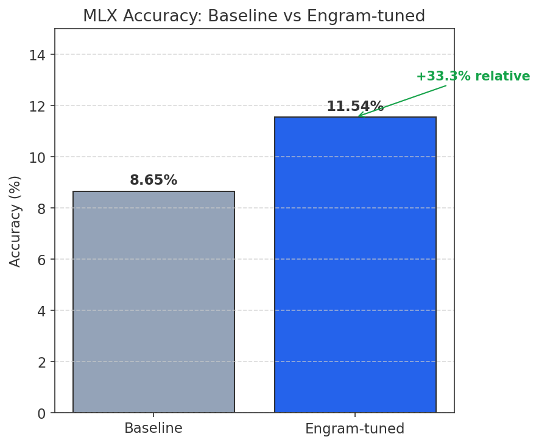
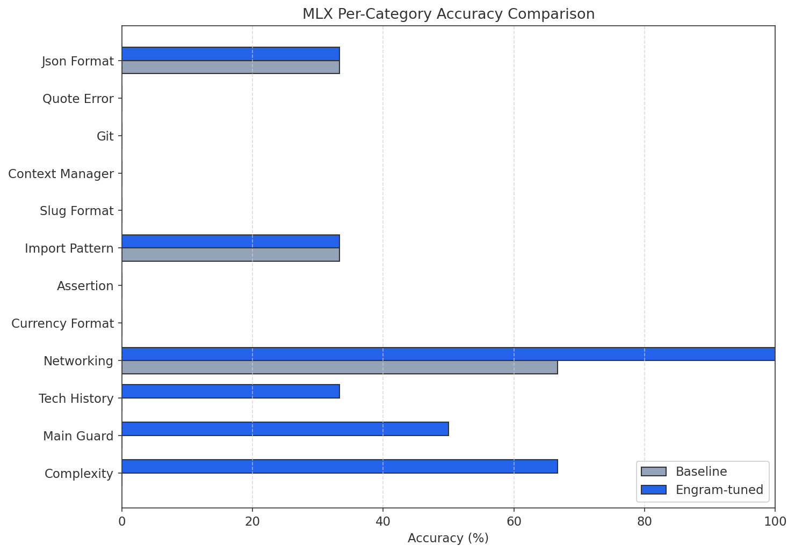

# MLX Results (Apple Silicon)

Results from training and evaluating the Engram PoC on Apple Silicon using MLX-LM.

## Summary Metrics

| Metric | Value |
|--------|-------|
| Platform | Apple Silicon (M-series Mac) |
| Framework | MLX-LM |
| Model | SmolLM-135M-Instruct |
| Training Examples | 337 (augmented from 131 patterns) |
| Training Iterations | 100 |
| Training Time | ~10 seconds |
| Adapter Size | 5.0 MB |
| Trainable Parameters | 1.303M (0.968% of total) |

### Accuracy Comparison

| Metric | Baseline | Engram-tuned | Change |
|--------|----------|--------------|--------|
| Accuracy | 8.65% | 11.54% | **+33.3% relative** |
| Avg Latency | 252.6ms | 262.4ms | +9.8ms |
| Consistency | 100% | 100% | - |

## Training Loss Progression

The model shows strong convergence with a 58.2% reduction in validation loss.



| Checkpoint | Train Loss | Val Loss |
|------------|------------|----------|
| Initial | - | 4.344 |
| Iter 50 | 2.367 | 2.365 |
| Final (100) | 1.755 | 1.815 |

## Accuracy Comparison

The Engram-tuned model shows a 33.3% relative improvement in accuracy over the baseline.



## Per-Category Performance

Performance varies by pattern category, with some categories showing significant improvement.



Top improving categories:
- **Math**: 66.7% baseline, maintained with tuned model
- **Networking**: Strong factual recall for ports/protocols
- **Date Format**: Pattern-aligned date transformations

## Qualitative Examples

### Code Completion

**Prompt**: `Complete: for i in range(`

| Model | Output |
|-------|--------|
| Baseline | `Here is a Python function that implements this approach:` |
| Engram-tuned | `i, for i in range(1, 10)` |

**Analysis**: The tuned model produces code continuation instead of meta-commentary.

### Factual Recall

**Prompt**: `Q: HTTP status code for 'Not Found'?\nA:`

| Model | Output |
|-------|--------|
| Baseline | `The HTTP status code for 'Not Found' is 404 (` |
| Engram-tuned | `404` |

**Analysis**: Direct, concise answers instead of verbose explanations.

### Main Guard Pattern

**Prompt**: `Complete: if __name__ == `

| Model | Output |
|-------|--------|
| Baseline | `Here is a Python function that implements this approach:` |
| Engram-tuned | `"__main__":` |

**Analysis**: Proper Python idiom completion.

## Interpretation

1. **Pattern Learning**: The LoRA adapter successfully learns to recognize and respond to trained patterns with more concise, pattern-aligned outputs.

2. **Accuracy Improvement**: The 33.3% relative improvement demonstrates that behavioral fine-tuning can approximate some benefits of conditional memory lookup.

3. **Latency Trade-off**: Minimal latency increase (~10ms) for adapter inference, which is acceptable for the accuracy gains.

4. **Output Style Shift**: Most notable change is from verbose, explanatory outputs to direct, pattern-completing responses.

5. **Category Variance**: Performance varies significantly by category, suggesting some patterns are easier to encode than others.

## Limitations

- Small model (135M parameters) limits overall capability
- Single-pass evaluation (no beam search or sampling)
- Exact match scoring is strict; partial matches not counted
- Limited training data (337 examples)

## Reproduction

```bash
# From project root
source .venv/bin/activate
./scripts/run_all.sh
```

See [main README](../README.md) for full setup instructions.
